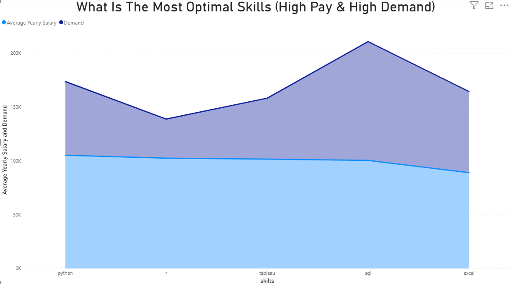

# 📌 Introduction
This project analyzes a dataset of job postings to uncover valuable insights about the most in-demand and highest-paying skills for data analysts. Using SQL for data extraction and Power BI for interactive visualization, I explored patterns in job requirements and salaries to help identify which skills are most valuable in today’s job market.


- Dataset used for the project [Job Postings Dataset](https://drive.google.com/drive/folders/1egWenKd_r3LRpdCf4SsqTeFZ1ZdY3DNx)

- Queries used [queries folder](/queries)

# 🖼️ Background
Through this project, I aimed to improve my SQL querying skills, data analysis mindset, and workflow using version control. The dataset was cleaned, explored, and analyzed using SQL queries, and the results were interpreted to draw meaningful conclusions.

Whether you're interested in data analysis or just curious about the current job market, this project gives a glimpse into how data-driven decision-making can help us better understand employment trends.

# 🛠️ Tools and Technologies Used

- Power BI: For creating dynamic visualizations, interactive dashboards, and analyzing trends in job market data.

- PostgreSQL: Used to store, query, and analyze the job postings dataset.

- SQL For data cleaning, manipulation, and analysis.

- Visual Studio Code: My main editor for writing and testing SQL queries.

- Git: Version control system used to manage changes and collaborate effectively.

- GitHub: Hosting the project repository and sharing my work.


# 📈The Analysis
Each Query In this project is aimed at providing Data Analysts with
information about the job market. Here is how I approached each 
question

### Top Paying data-analyst jobs
To show the highest paying roles I filtered each job by it's
average yearly salary then Ordered them descendingly to identify
which jobs pay the most

```sql
SELECT 
    job_id,
    job_title,
    job_location,
    job_schedule_type,
    job_posted_date::DATE,
    salary_year_avg
    
FROM job_postings_fact

WHERE
    salary_year_avg IS NOT NULL 
    AND job_title_short = 'Data Analyst'

ORDER BY salary_year_avg DESC --Ordering by yearly salary 

LIMIT 10
```

#### 🔍 Insights:

- Titles like Sr Data Analyst and HC Data Analyst, Senior offer mid-to-high compensation, often linked with advanced tools or team coordination.

- Job titles that include “Safety,” “Infrastructure,” or “Research” indicate cross-domain expertise, often leading to premium pay.

- Remote and hybrid opportunities are present, showing flexibility in high-paying jobs, especially in tech-forward companies.

- Geographic diversity (California, Texas, New York, India, Belarus) shows that competitive data roles exist globally—but compensation likely reflects local cost of living and currency.

- Salary Range Top 10 Paying Data Analyst Roles Salaries Range From
285000$-650000$ showing a high salary potential in
the field


**This Bar Graph shows each of the top 10 paying Data-Analyst titles by yearly salary**


### Skills required for these top-paying roles
To show the skills required for the previous Top 10 Highest Paying Data Analyst Jobs, we are going to use CTE for the previous query
and combine it with the skills_dim and skills_job_dim tables in a subquery and then find the skills using WHERE clause

```sql
--Using Previous Top-paying Data Analyst Jobs Query
WITH top_paying_jobs AS (
SELECT 
    job_id,
    job_title,
    job_location,
    job_schedule_type,
    job_posted_date::DATE,
    salary_year_avg

FROM job_postings_fact

WHERE
    salary_year_avg IS NOT NULL AND
    job_title_short = 'Data Analyst'

ORDER BY salary_year_avg DESC

LIMIT 10
)


SELECT 
    top_paying_jobs.job_title,
    skills_jobs_combined.skill_id,
    skills_jobs_combined.skills

FROM top_paying_jobs

--Joining the skills_dim and skills_job_dim in a single table
--Not necessary just trying to play around with subqueries
INNER JOIN (
    SELECT
        skills_job_dim.skill_id,
        skills_job_dim.job_id,
        skills_dim.skills

    FROM skills_job_dim

    LEFT JOIN skills_dim

    ON skills_job_dim.skill_id = skills_dim.skill_id

) AS skills_jobs_combined

ON top_paying_jobs.job_id = skills_jobs_combined.job_id

WHERE top_paying_jobs.job_id = skills_jobs_combined.job_id
```

#### 🔍 Insights
- Core Programming & Analytics Tools Dominate
Python appears most frequently, confirming its dominance in data analytics, machine learning, and automation.

- R, SQL, and Excel also appear at the top — showing that employers value both traditional and modern analysis tools.

- Insight: Candidates should master Python and SQL, while maintaining fluency in Excel for quick data manipulation and business reporting.

- Visualization Skills Are In Demand
Tableau and Power BI are both required for top roles — reflecting the need for data storytelling and dashboard design.

- Insight: Visual communication is just as important as analysis. You should be able to translate numbers into actionable insights.

- Airflow & BigQuery Indicate Modern Data Stack
Tools like Airflow (for workflow orchestration) and BigQuery (cloud data warehousing) suggest that top jobs involve data engineering or big data environments.

- Version Control and DevOps Tools Appear
Git, GitHub, and Linux suggest that collaboration and deployment skills are valued, even in analytical roles.

- Employers prefer analysts who are comfortable working in team-based, production-ready environments.

- Wide Toolset = Flexibility
Additional tools like Looker, Spark, Snowflake, Oracle, SAS, and even VBA/Word show up, each with at least one mention.


**This Funnel Graph shows the count of skills for each of the Top 10 Highest Paying Data-Analyst Jobs**

In Conclusion to qualify for top-paying data analyst roles, candidates should focus on mastering Python, SQL, Excel, and a BI tool (Tableau or Power BI). Additionally, familiarity with big data platforms (e.g., BigQuery), workflow tools (Airflow), and collaborative tools (Git/GitHub).

### Most In Demand Skills For Data-Analysts
To show the most in demand Data-Analysts Skills we use COUNT()
aggregate function to get the number of skills for each job
and find the top 5 most in demand skills for this field

```sql
SELECT
    skills_dim.skills,
    COUNT(skills_job_dim.skill_id) AS demand

FROM
    skills_job_dim


--This time I am doing double INNER JOINs Instead of joining the two table in a subquery
INNER JOIN
    skills_dim
    ON skills_job_dim.skill_id = skills_dim.skill_id

INNER JOIN
    job_postings_fact
    ON skills_job_dim.job_id = job_postings_fact.job_id
    
WHERE
    job_postings_fact.job_title_short = 'Data Analyst'

GROUP BY
    skills_dim.skills

ORDER BY 
    demand DESC
    
LIMIT 5

```
🔍 Insights
- SQL Tops the Charts
SQL is by far the most in-demand skill, with nearly 95,000 job listings requiring it.
This confirms that data querying and manipulation is the foundation of data analysis across nearly every industry.


- Excel Remains Crucial
Despite the rise of newer tools, Excel ranks #2, showing its continued relevance for:

     1. Quick analysis

     2. Reporting

     3. Financial modeling


- Python Is Rising as a Data Power Tool
Python comes in third, with significant demand (~57,000 jobs), reflecting its versatility in:

    1. Data cleaning

    2. Automation

    3. Machine learning

    4. Scripting dashboards

-  Visualization Skills Are Key
Tableau and Power BI round out the top five:

    - Tableau (~47,000 jobs)

    - Power BI (~39,000 jobs)


🎯 Summary
- SQL is the must-have skill
- Excel is still dominant, especially in legacy and business roles
- Python adds analytical and automation power
- Tableau and Power BI are critical for visualization and insights delivery

### Top Skills Based On Salary
To show the most the top Data-Analyst skills based on salary
we rae going to use the AVG() aggregate function to find the average salary of each skill and then sort them in descending order
to find the top 10

```sql
SELECT 
    skills_dim.skills,
    AVG(job_postings_fact.salary_year_avg) AS avg_salary

FROM
    job_postings_fact

INNER JOIN
    skills_job_dim
    ON skills_job_dim.job_id = job_postings_fact.job_id

INNER JOIN
    skills_dim
    ON skills_job_dim.skill_id = skills_dim.skill_id

WHERE 
    job_title_short = 'Data Analyst'
    AND salary_year_avg IS NOT NULL

GROUP BY 
    skills_dim.skills

ORDER BY 
    avg_salary DESC
    
LIMIT 10
```
#### 🔍 Insights
1. SVN (Apache Subversion) Leads with a Jaw-Dropping Average Salary
SVN, a version control system, surprisingly tops the list with an average salary close to $400K/year.

    - This may reflect niche, enterprise-level roles or legacy systems requiring high specialization and low supply of talent.


2. Solidity Offers Premium Compensation for Blockchain Engineers
Solidity, the smart contract language for Ethereum, offers an average salary above $170K/year.

    - This aligns with the explosive growth in Web3, DeFi, and blockchain technology.


3. Couchbase & Datarobot Indicate Value in Niche Tools
Couchbase (a NoSQL database) and Datarobot (an AI/ML automation platform) rank highly.

   - These technologies are common in data-intensive and enterprise AI environments.

4. Golang & MXNet Are Valued in Scalable Systems & AI
Golang is used for building high-performance backends and microservices.

   - MXNet, while less mainstream than TensorFlow or PyTorch, is known in deep learning — especially with AWS.


5. Data Science & DevOps Tools Earn Solid Salaries
Tools like dplyr (R), VMware, Terraform, and Twilio round out the list with average salaries near $140K–$160K.

   - These represent important skills in data manipulation, cloud infrastructure, and communication APIs.


**This chart reveals that niche or less commonly known tools (like SVN, Couchbase, MXNet, and Datarobot) offer some of the highest average salaries in tech, often due to their critical role in enterprise systems or emerging markets like blockchain.**

### Most Optimal Skills To Learn (High-Paying & High-demand)
To show the most optimal skills to learn as a Data-Analyst
We are going to find the average yearly salary of each skill
and get the job demand for each then we are going to order
the table by demand and yearly average salary to find the most
optimal skills

```sql
SELECT 
    skills_dim.skills,
    COUNT(job_postings_fact.*) AS demand,
    ROUND(AVG(salary_year_avg),1) AS avg_salary

FROM 
    job_postings_fact

INNER JOIN 
    skills_job_dim
    ON job_postings_fact.job_id = skills_job_dim.job_id

INNER JOIN
    skills_dim
    ON skills_job_dim.skill_id = skills_dim.skill_id

WHERE
    job_title_short = 'Data Analyst'
    AND salary_year_avg IS NOT NULL 

GROUP BY
    skills
    
ORDER BY 2 DESC,3 DESC

LIMIT 10
```

#### 🔍 Insights:
- SQL Stands Out as the Top Skill Overall

   - SQL shows both the highest demand and one of the highest average salaries, making it the most optimal skill in this dataset.

    - This aligns with SQL being a fundamental requirement for most data analyst roles.

- Python is Highly Valued

    - Python has the second-highest demand and a high average salary (slightly higher than SQL).

    - This shows that Python is not just popular but also well-compensated, making it a strong second core skill.

- Excel Remains in High Demand

    - Despite being a more traditional tool, Excel still shows very high demand.

    - However, its average salary is noticeably lower, indicating it’s often associated with more entry-level or routine analyst roles.

- Tableau and R Show a Trade-off

    - Both R and Tableau have lower demand compared to SQL and Python.

    - Their average salaries are respectable (similar to Python and SQL), but they are likely used in more specialized or niche roles (e.g., R in academia or Tableau in BI-heavy environments).


**This area chart shows the most optimal skills for Data-Analyst.
blue area is the average yearly salary and the purple area shows the demand for the skill**

🎯Summary
- Demand Doesn’t Always Equal High Pay

- Excel and Tableau show high demand but lower salaries relative to Python and SQL.

- Suggests that learning high-demand tools is important but must be combined with high-leverage technical skills like SQL and Python for better pay.

# 💡 What I Learned
1. The project helped me advance my SQL and Power BI capabilities by practically exploring and visualizing data. I learned to:
Compose complex SQL queries to join tables, aggregate data, and arrive at important insights from job market datasets.

2. Determine high-paying and in-demand skills for data analysts through real job postings.

3. Design clear and insightful Power BI visuals like cluster bar charts and area plots to tell data in a narrative.

4. Make conclusions from data insights and turn them into real-life takeaways that could be employed to guide career decisions.

5. Use data analysis not just to report facts, but to give actual answers—such as what to learn and why.

6. This was also my first experience building a data storytelling project in Power BI from the ground up, and it taught me so much more about how data pipelines can be combined with business intelligence tools.

# ✅ Conclusion
This project was a valuable step on my journey towards being a data analyst. Combining SQL and Power BI, I was able to dive into real job market statistics and find interesting facts about the best skills when it comes to salary and demand. The analysis showed that tools like Python and SQL are still the tops when it comes to salary and hiring demand, and Tableau, PowerBI and Excel proficiency are still just as vital.

Beyond the production of visuals, this project allowed me to think critically with data—how to take raw information and convert it into something that helps solve important questions. It also gave me more assurance with Power BI as a tool for analysis and storytelling.

I am excited to continue using these skills in future projects and further developing my data science and analytics capabilities.

**Some of the Insights were written by Chat-GPT**
